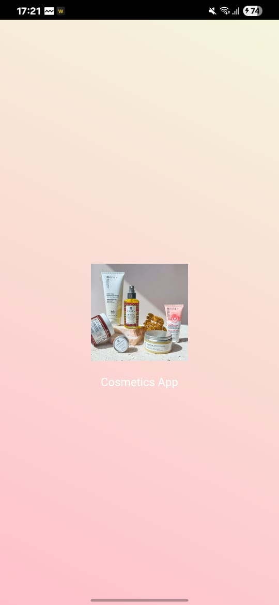
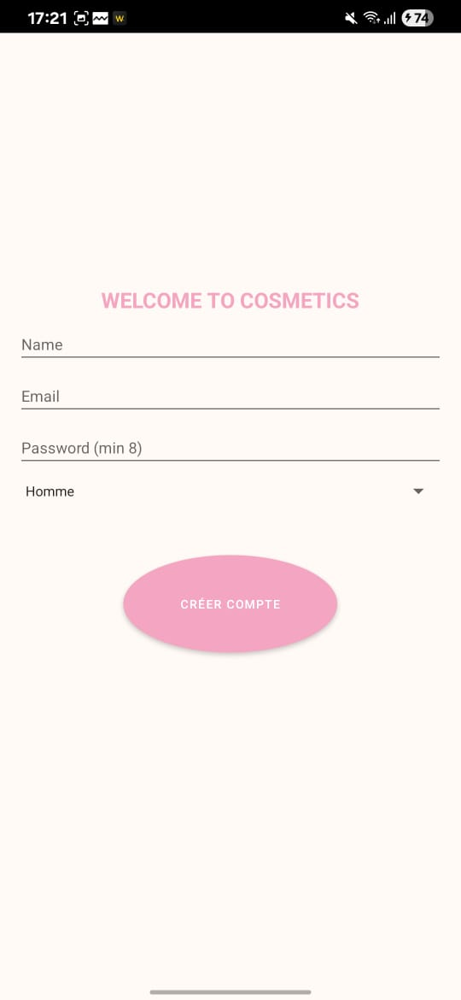
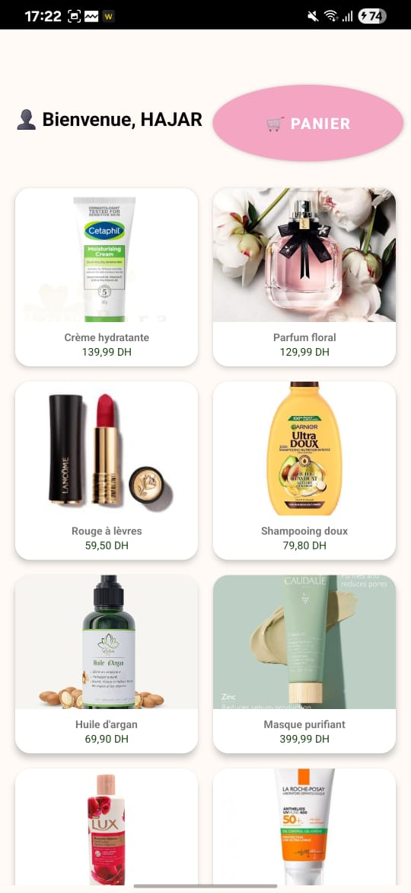
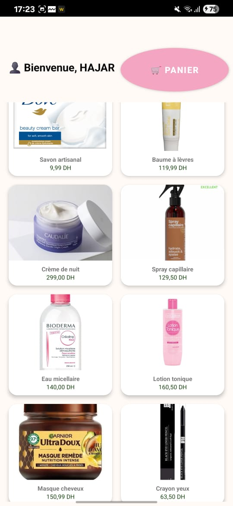
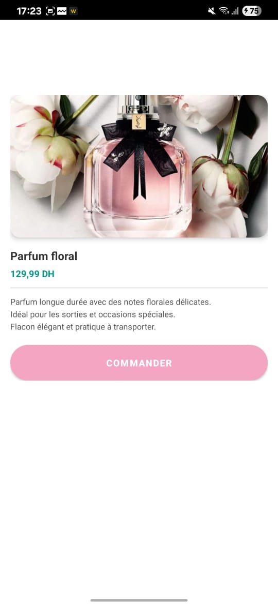
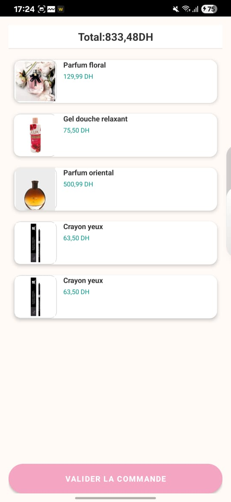
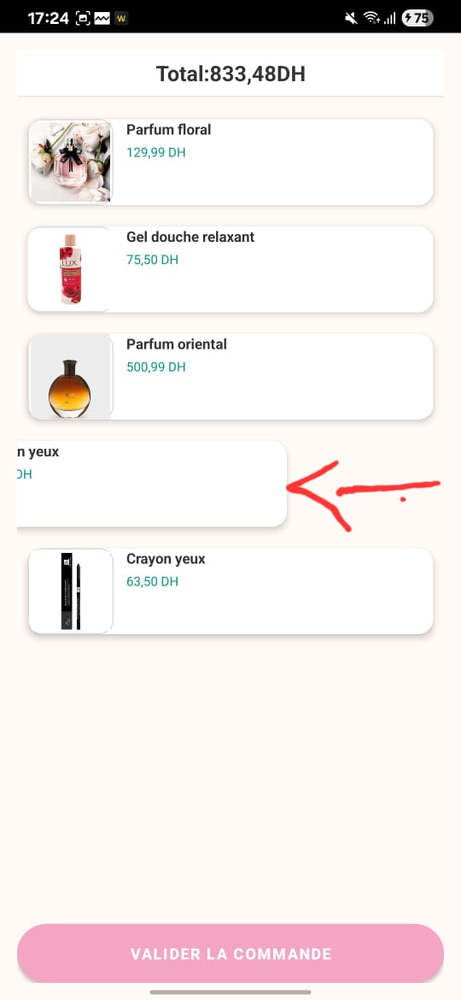
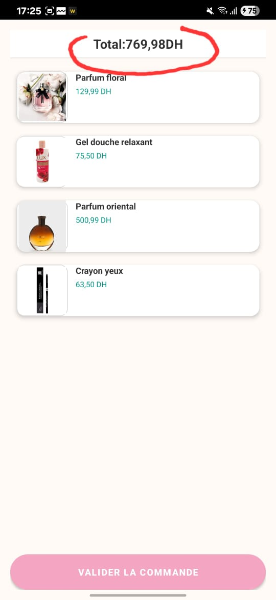
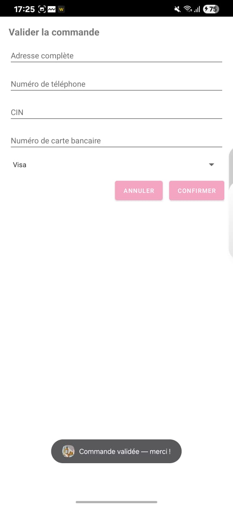

#  CosmeticsApp

CosmeticsApp est une application Android de commerce électronique dédiée aux *produits cosmétiques*.  
Elle offre des fonctionnalités telles que :

-  Créer un compte utilisateur  
-  Ajouter des produits au panier  
-  Supprimer des produits du panier  
-  Afficher les détails d’un produit  
-  Affichage dynamique avec RecyclerView  
-  Animations et interactions sur les images et cartes  

---

##  Fonctionnalités principales

###  Création de compte
Un formulaire permet de créer un compte avec :  
- Nom  
- Email (validé)  
- Mot de passe (8 caractères minimum)  
- Sélection du genre  

###  Gestion des produits
- Affichage des produits sous forme de grille avec *RecyclerView*.  
- Visualisation du *détail du produit* avec description complète, animations et option d’ajout au panier.  
- Ajout au panier via un *long click* ou depuis la page détail.  

###  Panier
- Affichage du panier avec *RecyclerView*.  
- Suppression de produits par *glissement gauche/droite*.  
- Calcul automatique du *total*.  

###  Validation de commande
- Formulaire de checkout avec :  
  - Adresse  
  - Téléphone  
  - CIN  
  - Numéro de carte et type de carte  
- Vérification des champs avant confirmation.  
- Affichage d’une *alerte de confirmation* après validation.

---

##  Captures d’écran 

  
  
  

  
  
  

---

